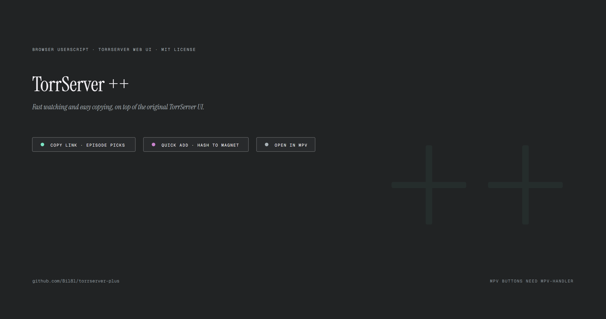
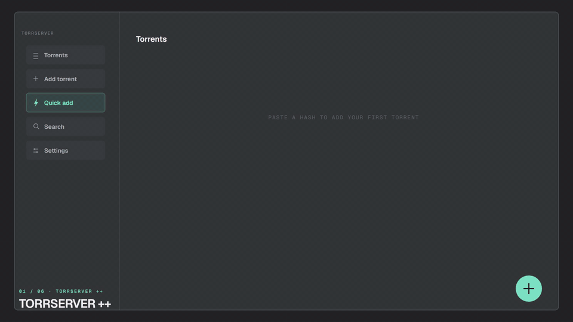

# TorrServer ++

A browser userscript that sits on top of the original [TorrServer web UI](https://github.com/yourok/torrserver) and leaves it untouched. Everything the original does keeps working exactly as before. TorrServer ++ adds faster paths for the three things you do most: add a torrent with one click, start watching without opening each torrent, and copy a link straight from the card grid.

## Left click or right click?

This is the one thing new users miss: every button the script adds responds to both mouse buttons.

| Button | Left click | Right click |
|---|---|---|
| **Copy link** (card) | copies the playlist (`.m3u`) link | opens the episode picker, copies one episode's direct link |
| **MPV** (card) | plays the whole playlist in mpv | opens the episode picker, plays one episode |
| **MPV** (details dialog) | plays that file | |

Want one specific episode? Right click. Want the whole thing? Left click.

## Install

1. Install [Tampermonkey](https://www.tampermonkey.net/) (Chrome, Edge) or [Violentmonkey](https://violentmonkey.github.io/) (Firefox).
2. Install the script from Greasy Fork: https://greasyfork.org/en/scripts/598825-torrserver, or from the `.user.js` file in this repository.
3. Open your TorrServer page. The script activates once the UI loads.

The script matches `localhost:8090` and any other host on port `8090`. If your server runs on a different port, edit the `@match` lines at the top of the script.

## Quick add

Paste any text containing info hashes, `magnet:` links or `.torrent` file links. The floating Paste-add button above Quick add skips the dialog entirely: one click reads the clipboard and drops the torrent straight onto the server, and it lights up whenever the clipboard holds something it can add. Duplicates are detected, trackers are appended, and everything goes straight to your server. With "Auto: clean name, category & cover" checked, the script waits for metadata, renames the torrent in the app's card format, works out whether it is a movie, a series or music, and files it under the matching category on your server (Movies / Series / Music / Other, plus any custom categories that already exist there; a category you picked by hand is never overwritten). It also picks the best cover it can find. Auto mode also repairs torrents that are already on the server — re-paste a hash and its name, category and cover get refreshed.

Cover sources, in order: TMDB (only if your server has a TMDB API key configured), IMDb, AniList, TVMaze, iTunes, Deezer, Wikipedia. Torrents that look like music (audio-only file lists, or album / soundtrack / FLAC markers in the name) are looked up on Deezer, iTunes and Wikipedia first. Lookups send the cleaned title only, and they are sent without cookies so they cannot be linked to any account you are signed in to.

## MPV playback (optional)

The MPV buttons need [mpv-handler](https://github.com/akiirui/mpv-handler) installed on the machine that runs your browser. Without it, clicking MPV does nothing because no app is registered for the `mpv-handler://` protocol.

The default config works with mpv-handler v0.4 and newer. For older versions set `MPV_SCHEME = 'legacy'` in the config block at the top of the script.

## Privacy

- The script reads your clipboard locally every couple of seconds so the floating button can light up. Clipboard content never leaves your machine.
- Torrents are posted only to your own TorrServer.
- Poster lookups send the cleaned release title to TMDB, IMDb, AniList, TVMaze, iTunes, Deezer or Wikipedia. That is the only outbound traffic, and the requests carry no cookies.
- No analytics, no ads, no tracking, no accounts.

## Troubleshooting

- **No buttons appear**: make sure you are on the TorrServer web page itself and that its port is `8090`, or edit the `@match` lines.
- **MPV click does nothing**: mpv-handler is not installed or not registered. Reinstall it and restart the browser.
- **The floating button never lights up**: browsers block clipboard reading on plain HTTP. Allow the "see text copied to the clipboard" permission when the browser asks, or just open Quick add and press `Ctrl+V`.
- **Dialog Copy link buttons are not recolored**: your UI language is not in the label list (English, Bulgarian, French, Romanian, Russian, Ukrainian, Chinese). Everything else works regardless.

## License

MIT. See [LICENSE](LICENSE).
